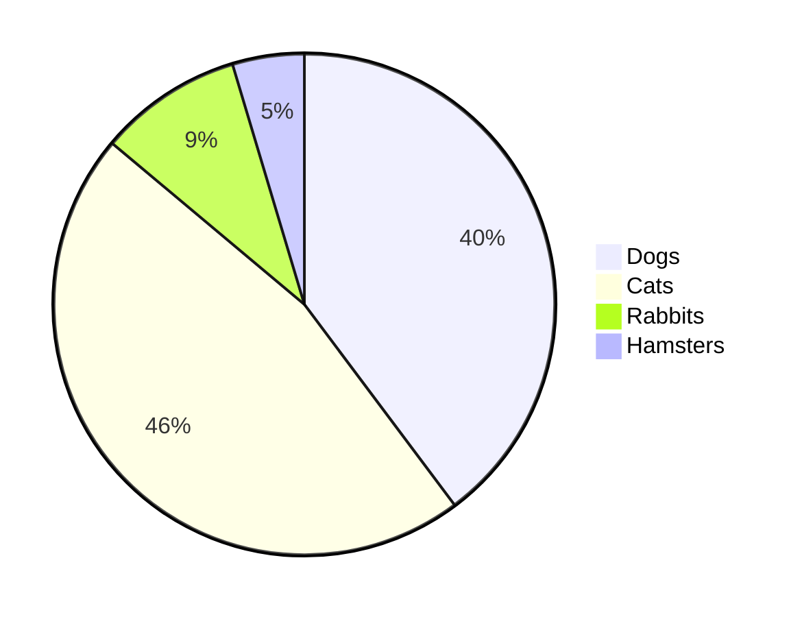

#  Testing out GitHub
## Is this a second title
## Maybe a third?

Lets try a link here

Maybe a table

| Rank | THING-TO-RANK |
|-----:|---------------|
|     1|               |
|     2|               |
|     3|               |

Let's do a drop down bar

Hi!

Let's make a drop down also a subheading

# 
Hello Hello

Did it work?

Lets add a comment to remind ourselves this needs updating. The comment should not be visble on the page... can you see it?
<!--we need to update this asap-->

<picture>
 <source media="(prefers-color-scheme: dark)" srcset="https://pixabay.com/images/search/dog/">
 <source media="(prefers-color-scheme: light)" srcset="https://pixabay.com/images/search/dog/">
 
</picture>

Maybe we should try a flowchart

Now a piechart

