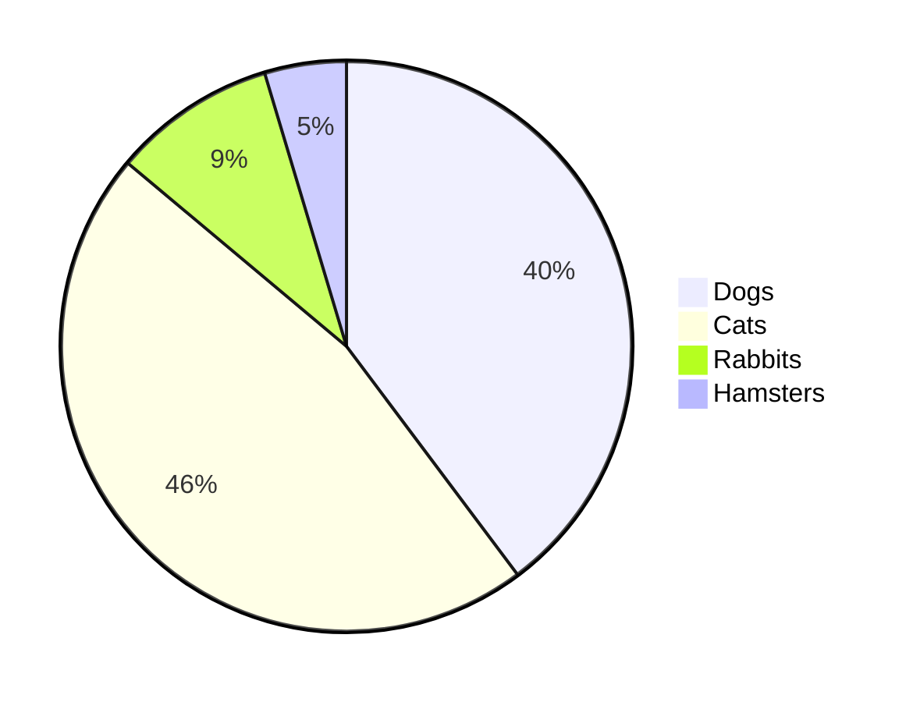

#  Testing out GitHub
## Is this a second title
## Maybe a third?

Lets try a link here

[Link Link](https://www.google.com/search?q=cufflinks&rlz=1C1GCEA_enGB932GB932&ei=HgbFY5n_HseagQarkZDwCw&ved=0ahUKEwiZhvzE0cv8AhVHTcAKHasIBL4Q4dUDCA8&uact=5&oq=cufflinks&gs_lcp=Cgxnd3Mtd2l6LXNlcnAQAzIHCAAQsQMQQzIECAAQQzIHCAAQsQMQQzIECAAQQzIHCAAQgAQQCjIHCAAQgAQQCjIECC4QQzIECAAQQzIHCAAQgAQQCjIHCAAQgAQQCjoICAAQBxAeEAo6BggAEAcQHkoECEEYAEoECEYYAFAAWNgCYIYFaABwAXgAgAF5iAHSApIBAzMuMZgBAKABAcABAQ&sclient=gws-wiz-serp)

Maybe a table

| Rank | THING-TO-RANK |
|-----:|---------------|
|     1|               |
|     2|               |
|     3|               |

**Bold text**

*Italics*

~~Strikethrough~~

Let's do a drop down bar

Hi!

Let's make a drop down also a subheading
# 

Hello Hello

Did it work?
# 

**No - how do I get this to work?**

Lets add a comment to remind ourselves this needs updating. The comment should not be visble on the page... can you see it?
<!--we need to update this asap-->

Maybe we should try a flowchart

Now a piechart

Can I create a task list?
- [x] #144
- [ ] [puppy picture link](https://www.google.com/search?q=picture+of+a+dog&rlz=1C1GCEA_enGB932GB932&oq=picture+of+a+dog&aqs=chrome..69i57.2112j0j7&sourceid=chrome&ie=UTF-8#imgrc=1te1HVeyj9G6qM)
- [ ] Add delight to the experience when all tasks are complete


